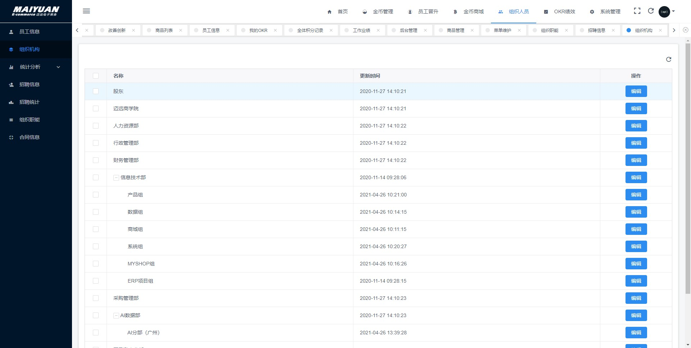

## 基本信息表格
<basic-information></basic-information>

## 技能清单
  **前言** 
    互联网是一片汪洋大海，学的越多，忘的就越多😂

  **程序语言** 
  - `java` `javascript` `typescript` `python` `node.js`

  **前端** 
  - js库：`jquery` `lodash` `moment.js` `three.js` `underscore.js`
  - js框架：`vue.js` `react.js` `Angular`
  - UI组件库 `ant-design` `element-ui` `iview` `vant-ui`
  - 构建工具 `gulp` `rollup` `webpack` `parcel`

  **java后端** 
  - 表现层框架: `spring` `spring-mvc` `spring-boot` `spring-cloud`
  - 持久层框架: `mybaits` `mybatis-plus` `hibernate`
  - 构建工具: `Mawen` `Gradle`

  **node后端** 
  - 表现层框架: `koa` `express` `egg`
  - 模板引擎: `nunjuncks`
  - 持久层框架: `sequelize`
  - 构建工具: `webpack` `gulp`

  **数据库** 
  - `mysql` `sqlserver` `postgresql`

## 项目经历(哈尔滨迈远电子商务有限公司)

  **OA系统**
  - 介绍：前端vue全家桶 + iview + restfulAPI
  - 系统模块
    - 首页看板（待开发）
    - 金币管理 （待开发）
      - 金币日志
      - 申请金币
    - 金币商城
      - 商品列表
      - 商品管理
      - 购买记录管理 （待开发）
    - 组织人员
      - 员工信息
      - 组织机构
      - 统计分析 （待开发）
       - 年度分析
       - 新员工分析
       - 月度部门人员分析
       - 离职数据分析
      - 招聘信息
      - 招聘统计
      - 组织职能
      - 合同信息
    - 员工晋升
      - 改善创新
      - 全体积分记录
      - 工作业绩
      - 积分纪录
      - 后台管理
      - 积分排行
    - OKR绩效
      - 我的OKR
      - 待我评分
      - 全部OKR列表
      - OKR周期管理
      - 上下级关系
    - 系统管理
      - 菜单维护
      - 用户管理
      - 权限管理
      - 日志管理
      - 应用接入 （待开发）
        - 应用分组
        - 应用管理
      - 接口维护
      - 接口分组
 
### OA系统项目截图（只展示非机密部分，你懂的😂）

**首页**

**金币管理**

**后台管理**

**合同信息**

**组织机构**

后续正在完善中 --->

<!-- 
  业务管理系统叫ERP
  客户管理系统叫CRM
  内部办公系统叫OA
  人力资源系统叫EHR
  内部文件加密系统叫DLP
  数据统计分析系统叫FOSS
  财务办公系统使用金蝶，并进行了二次开发。                                                                                                                                                                              -->

  <!--
   ERP系统德邦都淘汰好几年了，他们现在用的是自己研发的FOSS系统。
   办公系统用的还是OA，但是也有很多功能已经转移到CRM上去了。
   收货开单、跟踪查询、清仓出库、车辆交接用的是FOSS，装卸车扫描用的是PDA，
   快递分拣系统之前一直是在青岛有试点，不知道现在有没有普及使用。
   他们安排司机接货，专门给司机整了个APP。其他也没什么现代信息化技术了。 
   -->

<!-- ## 结语
  当我真正想写一份好的简历时，我竟不知该如何写。我总觉得，我所学会的知识，我所经历的事情，凡此种种皆不足够证明我。我并非有野心，只是想发一分光。一路上的努力前行，只为了看一看命行至何处。 -->

<!-- 正在火热更新中 -->

