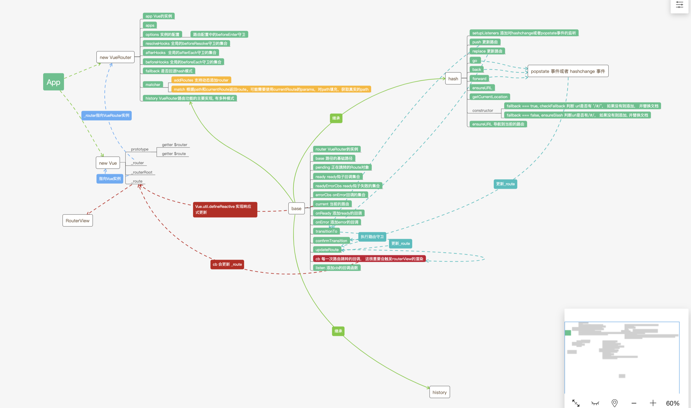

::: tip
VueRoter 即 Vue 路由
:::

## 流程图



## 前置基础知识

- 我们在学习 VueRouter 源码前，先来复习下 hash 以及 histroy 相关的知识。更多细节请参考 mdn 文档，本节内容节选自 mdn 文档。
- **onHashChange**:
  <br>
  当 URL 的片段标识符更改时，将触发 hashchange 事件 (跟在＃符号后面的 URL 部分，包括＃符号)。
  注意 histroy.pushState() 绝对不会触发 hashchange 事件，即使新的 URL 与旧的 URL 仅哈希不同也是如此。
- **pushState**:
  <br>
  pushState()需要三个参数: 一个状态对象, 一个标题(目前被忽略), 和一个 URL。
  - state, 状态对象 state 是一个 JavaScript 对象，popstate 事件触发时，该对象会传入回调函数
  - title, 目前所有浏览器忽略
  - url, 新的 url 记录
- **replaceState**:
  <br>
  history.replaceState()的使用与 history.pushState()非常相似，区别在于 replaceState()是修改了当前的历史记录项而不是新建一个。
- **onpopstate**:
  <br>
  调用 history.pushState()或者 history.replaceState()不会触发 popstate 事件. popstate 事件只会在浏览器某些行为下触发, 比如点击后退、前进按钮(或者在 JavaScript 中调用 history.back()、history.forward()、history.go()方法)。
  
  如果当前处于激活状态的历史记录条目是由 history.pushState()方法创建, 或者由 history.replaceState()方法修改过的, 则 popstate 事件对象的 state 属性包含了这个历史记录条目的 state 对象的一个拷贝。

## 应用初始化

通常构建一个 Vue 应用的时候, 我们会使用 Vue.use 以插件的形式安装 VueRouter。同时会在 Vue 的实例上挂载 router 的实例。

```javascript
import Vue from "vue";
import App from "./App.vue";
import router from "./router";

Vue.config.productionTip = false;

let a = new Vue({
  router,
  render: (h) => h(App),
}).$mount("#app");
```

```javascript
import Vue from "vue";
import Router from "vue-router";
import Home from "./views/Home.vue";

Vue.use(Router);

export default new Router({
  mode: "history",
  base: process.env.BASE_URL,
  routes: [
    {
      path: "/",
      name: "home",
      component: Home,
    },
    {
      path: "/about",
      name: "about",
      component: () =>
        import(/* webpackChunkName: "about" */ "./views/About.vue"),
    },
  ],
});
```


## 插件的安装
在Vue的文档中指出**Vue.js 的插件应该有一个公开方法 install。这个方法的第一个参数是 Vue 构造器，第二个参数是一个可选的选项对象**, 我们首先查看源码中install.js的文件。

在install文件中, 我们在Vue的实例上初始化了一些私有属性:
  - _routerRoot, 指向了Vue的实例
  - _router, 指向了VueRouter的实例

在Vue的prototype上初始化了一些getter:
  - $router, 当前Router的实例
  - $route, 当前Router的信息

并且在全局混入了mixin, 已经全局注册了RouterView, RouterLink组件.
```javascript

import View from './components/view'
import Link from './components/link'

export let _Vue

export function install (Vue) {
  if (install.installed && _Vue === Vue) return
  install.installed = true

  _Vue = Vue

  const isDef = v => v !== undefined

  const registerInstance = (vm, callVal) => {
    let i = vm.$options._parentVnode
    if (isDef(i) && isDef(i = i.data) && isDef(i = i.registerRouteInstance)) {
      i(vm, callVal)
    }
  }

  Vue.mixin({
    beforeCreate () {
      // 判断是否实例是否挂载了router
      if (isDef(this.$options.router)) {
        this._routerRoot = this
        this._router = this.$options.router
        this._router.init(this)
        // _router, 劫持的是当前的路由
        Vue.util.defineReactive(this, '_route', this._router.history.current)
      } else {
        this._routerRoot = (this.$parent && this.$parent._routerRoot) || this
      }
      registerInstance(this, this)
    },
    destroyed () {
      registerInstance(this)
    }
  })

  Object.defineProperty(Vue.prototype, '$router', {
    get () { return this._routerRoot._router }
  })

  Object.defineProperty(Vue.prototype, '$route', {
    get () { return this._routerRoot._route }
  })

  Vue.component('RouterView', View)
  Vue.component('RouterLink', Link)

  const strats = Vue.config.optionMergeStrategies
  strats.beforeRouteEnter = strats.beforeRouteLeave = strats.beforeRouteUpdate = strats.created
}
```
Vue.util.defineReactive, 这是Vue里面观察者劫持数据的方法，劫持_route，当_route触发setter方法的时候，则会通知到依赖的组件。而RouterView, 需要访问parent.$route所以形成了依赖(我们在后面会看到)

👀我们到Vue中看一下defineReactive的源码, 在defineReactive, 会对_route使用Object.defineProperty劫持setter方法。set时会通知观察者。

```javascript
Object.defineProperty(obj, key, {
  enumerable: true,
  configurable: true,
  get: function reactiveGetter () {
    // ...
  },
  set: function reactiveSetter (newVal) {
    // ...
    childOb = !shallow && observe(newVal)
    dep.notify()
  }
})
```

## VueRouter实例
```javascript

export default class VueRouter {
  constructor (options: RouterOptions = {}) {
    this.app = null
    this.apps = []
    this.options = options
    this.beforeHooks = []
    this.resolveHooks = []
    this.afterHooks = []
    this.matcher = createMatcher(options.routes || [], this)

    let mode = options.mode || 'hash'
    // fallback会在不支持history环境的情况下, 回退到hash模式
    this.fallback = mode === 'history' && !supportsPushState && options.fallback !== false
    if (this.fallback) {
      mode = 'hash'
    }
    if (!inBrowser) {
      mode = 'abstract'
    }
    this.mode = mode

    switch (mode) {
      case 'history':
        this.history = new HTML5History(this, options.base)
        break
      case 'hash':
        this.history = new HashHistory(this, options.base, this.fallback)
        break
      case 'abstract':
        this.history = new AbstractHistory(this, options.base)
        break
      default:
        if (process.env.NODE_ENV !== 'production') {
          assert(false, `invalid mode: ${mode}`)
        }
    }
  }
}
```

## matcher
matcher对象中包含了两个属性, addRoutes, match。

**pathList, pathMap, nameMap**<br>
pathList, pathMap, nameMap分别是路径的列表, 路径和路由对象的映射, 路由名称和路由对象的映射。vue-router目标支持动态路由, pathList, pathMap, nameMap可以在初始化后动态的被修改。它们由createRouteMap方法创建, 我们来看看createRouteMap的源码。
```javascript
export function createRouteMap (
  routes,
  oldPathList,
  oldPathMap,
  oldNameMap
) {
  // pathList，pathMap，nameMap支持后续的动态添加
  const pathList: Array<string> = oldPathList || []
  const pathMap: Dictionary<RouteRecord> = oldPathMap || Object.create(null)
  const nameMap: Dictionary<RouteRecord> = oldNameMap || Object.create(null)

  // 遍历路由列表
  routes.forEach(route => {
    addRouteRecord(pathList, pathMap, nameMap, route)
  })

  // 将通配符的路径, push到pathList的末尾
  for (let i = 0, l = pathList.length; i < l; i++) {
    if (pathList[i] === '*') {
      pathList.push(pathList.splice(i, 1)[0])
      l--
      i--
    }
  }

  return {
    pathList,
    pathMap,
    nameMap
  }
}
```
routes为一组路由, 所以我们循环routes, 但是route可能存在children所以我们通过递归的形式创建route。返回一个route的树🌲

```javascript

function addRouteRecord (
  pathList,
  pathMap,
  nameMap,
  route,
  parent,
  matchAs
) {
  const { path, name } = route
 
  const pathToRegexpOptions: PathToRegexpOptions = route.pathToRegexpOptions || {}

  // normalizePath, 会对path进行格式化
  // 会删除末尾的/，如果route是子级，会连接父级和子级的path，形成一个完整的path
  const normalizedPath = normalizePath(
    path,
    parent,
    pathToRegexpOptions.strict
  )

  if (typeof route.caseSensitive === 'boolean') {
    pathToRegexpOptions.sensitive = route.caseSensitive
  }

  // 创建一个完整的路由对象
  const record: RouteRecord = {
    path: normalizedPath,
    regex: compileRouteRegex(normalizedPath, pathToRegexpOptions),
    components: route.components || { default: route.component },
    instances: {},
    name,
    parent,
    matchAs,
    redirect: route.redirect,
    beforeEnter: route.beforeEnter,
    meta: route.meta || {},
    props: route.props == null
      ? {}
      : route.components
        ? route.props
        : { default: route.props }
  }

  // 如果route存在children, 我们会递归的创建路由对象
  // 递归的创建route对象
  if (route.children) {
    route.children.forEach(child => {
      const childMatchAs = matchAs
        ? cleanPath(`${matchAs}/${child.path}`)
        : undefined
      addRouteRecord(pathList, pathMap, nameMap, child, record, childMatchAs)
    })
  }

  // 这里是对路由别名的处理
  if (route.alias !== undefined) {
    const aliases = Array.isArray(route.alias)
      ? route.alias
      : [route.alias]

    aliases.forEach(alias => {
      const aliasRoute = {
        path: alias,
        children: route.children
      }
      addRouteRecord(
        pathList,
        pathMap,
        nameMap,
        aliasRoute,
        parent,
        record.path || '/' // matchAs
      )
    })
  }

  // 填充pathMap，nameMap，pathList
  if (!pathMap[record.path]) {
    pathList.push(record.path)
    pathMap[record.path] = record
  }

  if (name) {
    if (!nameMap[name]) {
      nameMap[name] = record
    }
  }
}
```

**addRoutes**<br>
动态添加更多的路由规则, 并动态的修改pathList，pathMap，nameMap
```javascript
function addRoutes (routes) {
  createRouteMap(routes, pathList, pathMap, nameMap)
}
```

### match
match方法根据参数raw(可以是字符串也可以Location对象), 以及currentRoute（当前的路由对象返回Route对象)，在nameMap中查找对应的Route，并返回。

如果location包含name, 我通过nameMap找到了对应的Route, 但是此时path中可能包含params, 所以我们会通过fillParams函数将params填充到patch，返回一个真实的路径path。
```javascript
function match (
  raw,
  currentRoute,
  redirectedFrom
) {
  // 会对raw，currentRoute处理，返回格式化后path, hash, 以及params
  const location = normalizeLocation(raw, currentRoute, false, router)

  const { name } = location

  if (name) {
    const record = nameMap[name]
    if (!record) return _createRoute(null, location)
    
    // 获取所有必须的params。如果optional为true说明params不是必须的
    const paramNames = record.regex.keys
      .filter(key => !key.optional)
      .map(key => key.name)

    if (typeof location.params !== 'object') {
      location.params = {}
    }

    if (currentRoute && typeof currentRoute.params === 'object') {
      for (const key in currentRoute.params) {
        if (!(key in location.params) && paramNames.indexOf(key) > -1) {
          location.params[key] = currentRoute.params[key]
        }
      }
    }

    if (record) {
      // 使用params对path进行填充返回一个真实的路径
      location.path = fillParams(record.path, location.params, `named route "${name}"`)
      // 创建Route对象
      return _createRoute(record, location, redirectedFrom)
    }
  } else if (location.path) {
    location.params = {}
    for (let i = 0; i < pathList.length; i++) {
      const path = pathList[i]
      const record = pathMap[path]
      // 使用pathList中的每一个regex，对path进行匹配
      if (matchRoute(record.regex, location.path, location.params)) {
        return _createRoute(record, location, redirectedFrom)
      }
    }
  }
  return _createRoute(null, location)
}
```
我们接下来继续看看_createRoute中做了什么。

```javascript
function _createRoute (
  record: ?RouteRecord,
  location: Location,
  redirectedFrom?: Location
): Route {
  if (record && record.redirect) {
    return redirect(record, redirectedFrom || location)
  }
  if (record && record.matchAs) {
    return alias(record, location, record.matchAs)
  }
  return createRoute(record, location, redirectedFrom, router)
}
```
其中redirect，alias最终都会调用createRoute方法。我们再将视角转向createRoute函数。createRoute函数会返回一个冻结的Router对象。

其中matched属性为一个数组，包含当前路由的所有嵌套路径片段的路由记录。数组的顺序为从外向里(树的外层到内层)。
```javascript
export function createRoute (
  record: ?RouteRecord,
  location: Location,
  redirectedFrom?: ?Location,
  router?: VueRouter
): Route {
  const stringifyQuery = router && router.options.stringifyQuery

  let query: any = location.query || {}
  try {
    query = clone(query)
  } catch (e) {}

  const route: Route = {
    name: location.name || (record && record.name),
    meta: (record && record.meta) || {},
    path: location.path || '/',
    hash: location.hash || '',
    query,
    params: location.params || {},
    fullPath: getFullPath(location, stringifyQuery),
    matched: record ? formatMatch(record) : []
  }
  if (redirectedFrom) {
    route.redirectedFrom = getFullPath(redirectedFrom, stringifyQuery)
  }
  return Object.freeze(route)
}
```

## init
init中。会挂载cb的回调，这关乎到RouteView的渲染。我们根据当前的url，在Vue根实例的beforeCreate生命周期钩子中完成路由的初始化，完成第一次的路由导航。
```js
init (app) {

  // app为Vue的实例
  this.apps.push(app)

  if (this.app) {
    return
  }

  // 在VueRouter上挂载app属性
  this.app = app

  const history = this.history

  // 初始化当前的路由，完成第一次导航，在hash模式下会在transitionTo的回调中调用setupListeners
  // setupListeners里会对hashchange事件进行监听
  // transitionTo是进行路由导航的函数，我们将会在下面介绍
  if (history instanceof HTML5History) {
    history.transitionTo(history.getCurrentLocation())
  } else if (history instanceof HashHistory) {
    const setupHashListener = () => {
      history.setupListeners()
    }
    history.transitionTo(
      history.getCurrentLocation(),
      setupHashListener,
      setupHashListener
    )
  }

  // 挂载了回调的cb， 每次更新路由更好更新_route
  history.listen(route => {
    this.apps.forEach((app) => {
      app._route = route
    })
  })
}
```

## history
history一共有三个模式hash, histroy, abstract, 这三个类都继承至base类

### base
我们首先看下base的构造函数, 其中router是VueRouter的实例, base是路由的基础路径。current是当前的路由默认为"/", ready是路由的状态, readyCbs是ready的回调的集合, readyErrorCbs是raday失败的回调。errorCbs导航出错的回调的集合。
```js
export class History {
  constructor (router: Router, base: ?string) {
    this.router = router
    // normalizeBase会对base路径做出格式化的处理，会为base开头自动添加‘/’，删除结尾的‘/’，默认返回’/‘
    this.base = normalizeBase(base)
    // 初始化的当前路由对象
    this.current = START
    this.pending = null
    this.ready = false
    this.readyCbs = []
    this.readyErrorCbs = []
    this.errorCbs = []
  }
}
```
```js
export const START = createRoute(null, {
  path: '/'
})
```
```js
function normalizeBase (base: ?string): string {
  if (!base) {
    // inBrowser判断是否为浏览器环境
    if (inBrowser) {
      const baseEl = document.querySelector('base')
      base = (baseEl && baseEl.getAttribute('href')) || '/'
      base = base.replace(/^https?:\/\/[^\/]+/, '')
    } else {
      base = '/'
    }
  }
  if (base.charAt(0) !== '/') {
    base = '/' + base
  }
  return base.replace(/\/$/, '')
}
```
base中的listen的方法，会在VueRouter的init方法中使用到，listen会给每一次的路由的更新，添加回调
```js
listen (cb: Function) {
  this.cb = cb
}   
```
base类中还有一些其他方法比如，transitionTo，confirmTransition，updateRoute它们在base子类中被使用。我们马上在hashrouter中再看看它们的具体实现。

### HashRouter构造函数
在HashHistory的构造函数中。我们会判断当前的fallback是否为true。如果为true，使用checkFallback，添加’#‘，并使用window.location.replace替换文档。

如果fallback为false，我们会调用ensureSlash，ensureSlash会为没有“#”的url，添加“#”，并且使用histroy的API或者replace替换文档。

所以我们在访问127.0.0.1的时候，会自动替换为127.0.0.1/#/

```js
export class HashHistory extends History {
  constructor (router: Router, base: ?string, fallback: boolean) {
    super(router, base)
    // 如果是回退hash的情况，并且判断当前路径是否有/#/。如果没有将会添加'/#/'
    if (fallback && checkFallback(this.base)) {
      return
    }
    ensureSlash()
  }
}
```
callback
```js
// 检查url是否包含‘/#/’
function checkFallback (base) {
  // 获取hash值
  const location = getLocation(base)
  // 如果location不是以/#，开头。添加/#，使用window.location.replace替换文档
  if (!/^\/#/.test(location)) {
    window.location.replace(
      cleanPath(base + '/#' + location)
    )
    return true
  }
}
```
```js
// 返回hash
export function getLocation (base) {
  let path = decodeURI(window.location.pathname)
  if (base && path.indexOf(base) === 0) {
    path = path.slice(base.length)
  }
  return (path || '/') + window.location.search + window.location.hash
}
```
```js
// 删除 //, 替换为 /
export function cleanPath (path) {
  return path.replace(/\/\//g, '/')
}
```
ensureSlash
```js
function ensureSlash (): boolean {
  // 判断是否包含#，并获取hash值。如果url没有#，则返回‘’
  const path = getHash()
  // 判断path是否以/开头
  if (path.charAt(0) === '/') {
    return true
  }
  // 如果开头不是‘/’, 则添加/
  replaceHash('/' + path)
  return false
}
```
```js
// 获取“#”后面的hash
export function getHash (): string {
  const href = window.location.href
  const index = href.indexOf('#')
  return index === -1 ? '' : decodeURI(href.slice(index + 1))
}
```
```js
function replaceHash (path) {
  // supportsPushState判断是否存在history的API
  // 使用replaceState或者window.location.replace替换文档
  // getUrl获取完整的url
  if (supportsPushState) {
    replaceState(getUrl(path))
  } else {
    window.location.replace(getUrl(path))
  }
}
```
```js
// getUrl返回了完整了路径，并且会添加#, 确保存在/#/
function getUrl (path) {
  const href = window.location.href
  const i = href.indexOf('#')
  const base = i >= 0 ? href.slice(0, i) : href
  return `${base}#${path}`
}
```
在replaceHash中，我们调用了replaceState方法，在replaceState方法中，又调用了pushState方法。在pushState中我们会调用saveScrollPosition方法，它会记录当前的滚动的位置信息。然后使用histroyAPI，或者window.location.replace完成文档的更新。
```js

export function replaceState (url?: string) {
  pushState(url, true)
}

export function pushState (url?: string, replace?: boolean) {
  // 记录当前的x轴和y轴，以发生导航的时间为key，位置信息记录在positionStore中
  saveScrollPosition()
  const history = window.history
  try {
    if (replace) {
      history.replaceState({ key: _key }, '', url)
    } else {
      _key = genKey()
      history.pushState({ key: _key }, '', url)
    }
  } catch (e) {
    window.location[replace ? 'replace' : 'assign'](url)
  }
}
```
**push, replace** <br>
我们把push，replace放在一起说，因为它们实现的源码都是类似的。在push和replace中，调用transitionTo方法，transitionTo方法在基类base中，我们现在转过头来看看transitionTo的源码(👇往下两节，代码不是很难，但是callback嵌套callback, 如蜜传如蜜，看起来还是比较恶心的)
```js
push (location, onComplete, onAbort) {
  const { current: fromRoute } = this
  this.transitionTo(
    location,
    route => {
      pushHash(route.fullPath)
      handleScroll(this.router, route, fromRoute, false)
      onComplete && onComplete(route)
    },
    onAbort
  )
}

replace (location, onComplete, onAbort) {
  const { current: fromRoute } = this
  this.transitionTo(
    location,
    route => {
      replaceHash(route.fullPath)
      handleScroll(this.router, route, fromRoute, false)
      onComplete && onComplete(route)
    },
    onAbort
  )
}
```
**transitionTo, confirmTransition, updateRoute**

transitionTo的location参数是我们的目标路径, 可以是string或者RawLocation对象。我们通过router.match方法(我们在在matcher介绍过)，router.match会返回我们的目标路由对象。紧接着我们会调用confirmTransition函数。
```js
transitionTo (location, onComplete, onAbort) {
  const route = this.router.match(location, this.current)
  this.confirmTransition(
    route,
    () => {
      // ...
    },
    err => {
      // ...
    }
  )
}
```
confirmTransition函数中会使用，isSameRoute会检测是否导航到相同的路由，如果导航到相同的路由会停止🤚导航，并执行终止导航的回调。
```js
if (
  isSameRoute(route, current) &&
  route.matched.length === current.matched.length
) {
  this.ensureURL()
  return abort()
}
```
接着我们调用resolveQueue方法，resolveQueue接受当前的路由和目标的路由的matched属性作为参数，resolveQueue的工作方式可以如下图所示。我们会逐一比较两个数组的路由，寻找出需要销毁的，需要更新的，需要激活的路由，并返回它们（因为我们需要执行它们不同的路由守卫）

```js
function resolveQueue (
  current
  next
) {
  let i
  // 依次比对当前的路由和目标的路由的matched属性中的每一个路由
  const max = Math.max(current.length, next.length)
  for (i = 0; i < max; i++) {
    if (current[i] !== next[i]) {
      break
    }
  }
  return {
    updated: next.slice(0, i),
    activated: next.slice(i),
    deactivated: current.slice(i)
  }
}
```
下一步，我们会逐一提取出，所有要执行的路由守卫，将它们concat到队列queue。queue里存放里所有需要在这次路由更新中执行的路由守卫。

第一步，我们使用extractLeaveGuards函数，提取出deactivated中所有需要销毁的组件内的“beforeRouteLeave”的守卫。extractLeaveGuards函数中会调用extractGuards函数，extractGuards函数，会调用flatMapComponents函数，flatMapComponents函数会遍历records(**resolveQueue返回deactivated**), 在遍历过程中我们将组件，组件的实例，route对象，传入了fn(**extractGuards中传入flatMapComponents的回调**), 在fn中我们会获取组件中beforeRouteLeave守卫。
```js
// 返回每一个组件中导航的集合
function extractLeaveGuards (deactivated) {
  return extractGuards(deactivated, 'beforeRouteLeave', bindGuard, true)
}

function extractGuards (
  records,
  name,
  bind,
  reverse?
) {
  const guards = flatMapComponents(
    records,
    // def为组件
    // instance为组件的实例
    (def, instance, match, key) => {
      // 返回每一个组件中定义的路由守卫
      const guard = extractGuard(def, name)
      if (guard) {
        // bindGuard函数确保了guard（路由守卫）的this指向的是Component中的实例
        return Array.isArray(guard)
          ? guard.map(guard => bind(guard, instance, match, key))
          : bind(guard, instance, match, key)
      }
    }
  )
  // 返回导航的集合
  return flatten(reverse ? guards.reverse() : guards)
}

export function flatMapComponents (
  matched,
  fn
) {
  // 遍历matched，并返回matched中每一个route中的每一个Component
  return flatten(matched.map(m => {
    // 如果没有设置components则默认是components{ default: YouComponent }，可以从addRouteRecord函数中看到
    // 将每一个matched中所有的component传入fn中
    // m.components[key]为components中的key键对应的组件
    // m.instances[key]为组件的实例，这个属性是在routerview组件中beforecreated中被赋值的
    return Object.keys(m.components).map(key => fn(
      m.components[key],
      m.instances[key],
      m,
      key
    ))
  }))
}

// 返回一个新数组
export function flatten (arr) {
  return Array.prototype.concat.apply([], arr)
}

// 获取组件中的属性
function extractGuard (def, key) {
  if (typeof def !== 'function') {
    def = _Vue.extend(def)
  }
  return def.options[key]
}

// 修正函数的this指向
function bindGuard (guard, instance) {
  if (instance) {
    return function boundRouteGuard () {
      return guard.apply(instance, arguments)
    }
  }
}
```
第二步，获取全局VueRouter对象beforeEach的守卫

第三步, 使用extractUpdateHooks函数，提取出update组件中所有的beforeRouteUpdate的守卫。过程同第一步类似。

第四步, 获取activated的options配置中beforeEach守卫

第五步, 获取所有的异步组件

在获取所有的路由守卫后我们定义了一个迭代器iterator。接着我们使用runQueue遍历queue队列。将queue队列中每一个元素传入fn(迭代器iterator)中，在迭代器中会执行路由守卫，并且路由守卫中必须明确的调用next方法才会进入下一个管道，进入下一次迭代。迭代完成后，会执行runQueue的callback。

在runQueue的callback中，我们获取激活组件内的beforeRouteEnter的守卫，并且将beforeRouteEnter守卫中next的回调存入postEnterCbs中，在导航被确认后遍历postEnterCbs执行next的回调。

在queue队列执行完成后，confirmTransition函数会执行transitionTo传入的onComplete的回调。往下看👇

```js
// queue为路由守卫的队列
// fn为定义的迭代器
export function runQueue (queue, fn, cb) {
  const step = index => {
    if (index >= queue.length) {
      cb()
    } else {
      if (queue[index]) {
        // 使用迭代器处理每一个钩子
        // fn是迭代器
        fn(queue[index], () => {
          step(index + 1)
        })
      } else {
        step(index + 1)
      }
    }
  }
  step(0)
}

// 迭代器
const iterator = (hook, next) => {
  if (this.pending !== route) {
    return abort()
  }
  try {
    // 传入路由守卫三个参数，分别分别对应to，from，next
    hook(route, current, (to: any) => {
      if (to === false || isError(to)) {
        // 如果next的参数为false
        this.ensureURL(true)
        abort(to)
      } else if (
        // 如果next需要重定向到其他路由
        typeof to === 'string' ||
        (typeof to === 'object' && (
          typeof to.path === 'string' ||
          typeof to.name === 'string'
        ))
      ) {
        abort()
        if (typeof to === 'object' && to.replace) {
          this.replace(to)
        } else {
          this.push(to)
        }
      } else {
        // 进入下个管道
        next(to)
      }
    })
  } catch (e) {
    abort(e)
  }
}

runQueue(
  queue,
  iterator,
  () => {
    const postEnterCbs = []
    const isValid = () => this.current === route
    // 获取所有激活组件内部的路由守卫beforeRouteEnter，组件内的beforeRouteEnter守卫，是无法获取this实例的
    // 因为这时激活的组件还没有创建，但是我们可以通过传一个回调给next来访问组件实例。
    // beforeRouteEnter (to, from, next) {
    //   next(vm => {
    //     // 通过 `vm` 访问组件实例
    //   })
    // }
    const enterGuards = extractEnterGuards(activated, postEnterCbs, isValid)
    // 获取全局的beforeResolve的路由守卫
    const queue = enterGuards.concat(this.router.resolveHooks)
    // 再一次遍历queue
    runQueue(queue, iterator, () => {
      // 完成过渡
      if (this.pending !== route) {
        return abort()
      }
      // 正在过渡的路由设置为null
      this.pending = null
      // 
      onComplete(route)
      // 导航被确认后，我们执行beforeRouteEnter守卫中，next的回调
      if (this.router.app) {
        this.router.app.$nextTick(() => {
          postEnterCbs.forEach(cb => { cb() })
        })
      }
    }
  )
})

// 获取组件中的beforeRouteEnter守卫
function extractEnterGuards (
  activated,
  cbs,
  isValid
) {
  return extractGuards(activated, 'beforeRouteEnter', (guard, _, match, key) => {
    // 这里没有修改guard（守卫）中this的指向
    return bindEnterGuard(guard, match, key, cbs, isValid)
  })
}

// 将beforeRouteEnter守卫中next的回调push到postEnterCbs中
function bindEnterGuard (
  guard,
  match,
  key,
  cbs,
  isValid
) {
  // 这里的next参数是迭代器中传入的参数
  return function routeEnterGuard (to, from, next) {
    return guard(to, from, cb => {
      // 执行迭代器中传入的next，进入下一个管道
      next(cb)
      if (typeof cb === 'function') {
        // 我们将next的回调包装后保存到cbs中，next的回调会在导航被确认的时候执行回调
        cbs.push(() => {
          poll(cb, match.instances, key, isValid)
        })
      }
    })
  }
}
```
在confirmTransition的onComplete回调中，我们调用updateRoute方法, 参数是导航的路由。在updateRoute中我们会更新当前的路由(**history.current**), 并执行cb(**更新Vue实例上的_route属性，🌟这会触发RouterView的重新渲染**）
```js
updateRoute (route: Route) {
  const prev = this.current
  this.current = route
  this.cb && this.cb(route)
  // 执行after的钩子
  this.router.afterHooks.forEach(hook => {
    hook && hook(route, prev)
  })
}
```
接着我们执行transitionTo的回调函数onComplete。在回调中会调用replaceHash或者pushHash方法。它们会更新location的hash值。如果兼容historyAPI，会使用history.replaceState或者history.pushState。如果不兼容historyAPI会使用window.location.replace或者window.location.hash。而handleScroll方法则是会更新我们的滚动条的位置我们这里就不在细说了。
```js
// replaceHash方法
(route) => {
  replaceHash(route.fullPath)
  handleScroll(this.router, route, fromRoute, false)
  onComplete && onComplete(route)
}

// push方法
route => {
  pushHash(route.fullPath)
  handleScroll(this.router, route, fromRoute, false)
  onComplete && onComplete(route)
}
```
好了，现在我们就把，replace或者push方法的流程说完了。

🎉🎉🎉🎉🎉🎉 以下是transitionTo，confirmTransition中完整的代码。 🎉🎉🎉🎉🎉🎉
```js
// onComplete 导航成功的回调
// onAbort 导航终止的回调
transitionTo (location, onComplete, onAbort) {
  const route = this.router.match(location, this.current)
  this.confirmTransition(route,
    () => {
      this.updateRoute(route)
      onComplete && onComplete(route)
      this.ensureURL()
      if (!this.ready) {
        this.ready = true
        this.readyCbs.forEach(cb => { cb(route) })
      }
    },
    err => {
      if (onAbort) {
        onAbort(err)
      }
      if (err && !this.ready) {
        this.ready = true
        this.readyErrorCbs.forEach(cb => { cb(err) })
      }
    }
  )
}

// onComplete 导航成功的回调
// onAbort 导航终止的回调
confirmTransition (route: Route, onComplete: Function, onAbort?: Function) {

  // 当前的路由
  const current = this.current

  const abort = err => {
    if (isError(err)) {
      if (this.errorCbs.length) {
        this.errorCbs.forEach(cb => { cb(err) })
      }
    }
    onAbort && onAbort(err)
  }
  
  // 判断是否导航到相同的路由，如果是我们终止导航
  if (
    isSameRoute(route, current) &&
    route.matched.length === current.matched.length
  ) {
    this.ensureURL()
    return abort()
  }

  // 获取所有需要激活，更新，销毁的路由
  const {
    updated,
    deactivated,
    activated
  } = resolveQueue(this.current.matched, route.matched)

  // 获取所有需要执行的路由守卫
  const queue = [].concat(
    extractLeaveGuards(deactivated),
    this.router.beforeHooks,
    extractUpdateHooks(updated), 
    activated.map(m => m.beforeEnter),
    resolveAsyncComponents(activated)
  )

  this.pending = route

  // 定义迭代器
  const iterator = (hook: NavigationGuard, next) => {
    if (this.pending !== route) {
      return abort()
    }
    try {
      hook(route, current, (to: any) => {
        if (to === false || isError(to)) {
          this.ensureURL(true)
          abort(to)
        } else if (
          typeof to === 'string' ||
          (typeof to === 'object' && (
            typeof to.path === 'string' ||
            typeof to.name === 'string'
          ))
        ) {
          abort()
          if (typeof to === 'object' && to.replace) {
            this.replace(to)
          } else {
            this.push(to)
          }
        } else {
          next(to)
        }
      })
    } catch (e) {
      abort(e)
    }
  }

  // 迭代所有的路由守卫
  runQueue(
    queue,
    iterator, 
    () => {
      const postEnterCbs = []
      const isValid = () => this.current === route
      const enterGuards = extractEnterGuards(activated, postEnterCbs, isValid)
      const queue = enterGuards.concat(this.router.resolveHooks)
      runQueue(queue, iterator, () => {
        if (this.pending !== route) {
          return abort()
        }
        this.pending = null
        onComplete(route)
        if (this.router.app) {
          this.router.app.$nextTick(() => {
            postEnterCbs.forEach(cb => { cb() })
          })
        }
      }
    )
  })
}
```

**go, forward, back**
在VueRouter上定义的go，forward，back方法都是调用history的属性的go方法
```js
// index.js

go (n) {
  this.history.go(n)
}

back () {
  this.go(-1)
}

forward () {
  this.go(1)
}
```
而hash上go方法调用的是history.go，它是如何更新RouteView的呢？答案是hash对象在setupListeners方法中添加了对popstate或者hashchange事件的监听。在事件的回调中会触发RoterView的更新
```js
// go方法调用history.go
go (n) {
  window.history.go(n)
}
```
**setupListeners**
我们在通过点击后退, 前进按钮或者调用back, forward, go方法的时候。我们没有主动更新_app.route和current。我们该如何触发RouterView的更新呢？通过在window上监听popstate，或者hashchange事件。在事件的回调中，调用transitionTo方法完成对_route和current的更新。

或者可以这样说，在使用push，replace方法的时候，hash的更新在_route更新的后面。而使用go, back时，hash的更新在_route更新的前面。
```js
setupListeners () {
  const router = this.router

  const expectScroll = router.options.scrollBehavior
  const supportsScroll = supportsPushState && expectScroll

  if (supportsScroll) {
    setupScroll()
  }

  window.addEventListener(supportsPushState ? 'popstate' : 'hashchange', () => {
    const current = this.current
    if (!ensureSlash()) {
      return
    }
    this.transitionTo(getHash(), route => {
      if (supportsScroll) {
        handleScroll(this.router, route, current, true)
      }
      if (!supportsPushState) {
        replaceHash(route.fullPath)
      }
    })
  })
}
```

**HistoryRouter**
HistoryRouter的实现基本于HashRouter一致。差异在于HistoryRouter不会做一些容错处理，不会判断当前环境是否支持historyAPI。默认监听popstate事件，默认使用histroyAPI。感兴趣的同学可以看/history/html5.js中关于HistoryRouter的定义。

## 组件
### RouterView
RouterView是可以互相嵌套的，RouterView依赖了parent.$route属性，parent.$route即this._routerRoot._route。我们使用Vue.util.defineReactive将_router设置为响应式的。在transitionTo的回调中会更新_route, 这会触发RouteView的渲染。(渲染机制目前不是很了解，目前还没有看过Vue的源码，猛男落泪)。
```js
export default {
  name: 'RouterView',
  functional: true,
  // RouterView的name, 默认是default
  props: {
    name: {
      type: String,
      default: 'default'
    }
  },
  render (_, { props, children, parent, data }) {
    data.routerView = true

    // h为渲染函数
    const h = parent.$createElement
    const name = props.name
    const route = parent.$route
    const cache = parent._routerViewCache || (parent._routerViewCache = {})

    let depth = 0
    let inactive = false
    // 使用while循环找到Vue的根节点, _routerRoot是Vue的根实例
    // depth为当前的RouteView的深度，因为RouteView可以互相嵌套，depth可以帮组我们找到每一级RouteView需要渲染的组件
    while (parent && parent._routerRoot !== parent) {
      if (parent.$vnode && parent.$vnode.data.routerView) {
        depth++
      }
      if (parent._inactive) {
        inactive = true
      }
      parent = parent.$parent
    }
    data.routerViewDepth = depth

    if (inactive) {
      return h(cache[name], data, children)
    }

    const matched = route.matched[depth]
    if (!matched) {
      cache[name] = null
      return h()
    }

    // 获取到渲染的组件
    const component = cache[name] = matched.components[name]

    // registerRouteInstance会在beforeCreated中调用，又全局的Vue.mixin实现
    // 在matched.instances上注册组件的实例, 这会帮助我们修正confirmTransition中执行路由守卫中内部的this的指向
    data.registerRouteInstance = (vm, val) => {
      const current = matched.instances[name]
      if (
        (val && current !== vm) ||
        (!val && current === vm)
      ) {
        matched.instances[name] = val
      }
    }

    ;(data.hook || (data.hook = {})).prepatch = (_, vnode) => {
      matched.instances[name] = vnode.componentInstance
    }

    let propsToPass = data.props = resolveProps(route, matched.props && matched.props[name])
    if (propsToPass) {
      propsToPass = data.props = extend({}, propsToPass)
      const attrs = data.attrs = data.attrs || {}
      for (const key in propsToPass) {
        if (!component.props || !(key in component.props)) {
          attrs[key] = propsToPass[key]
          delete propsToPass[key]
        }
      }
    }
    // 渲染组件
    return h(component, data, children)
  }
}
```

## 结语
我们把VueRouter源码看完了。总体来说不是很复杂。**总的来说就是使用Vue.util.defineReactive将实例的_route属性设置为响应式。而push, replace方法会主动更新属性_route。而go，back，或者点击前进后退的按钮则会在onhashchange或者onpopstate的回调中更新_route，而_route的更新会触发RoterView的重新渲染**

但是也略过了比如keep-live，滚动行为的处理。我打算接下来，结合VueRouter核心原理实现了一个简易版的VueRouter,当然现在还没有开始。